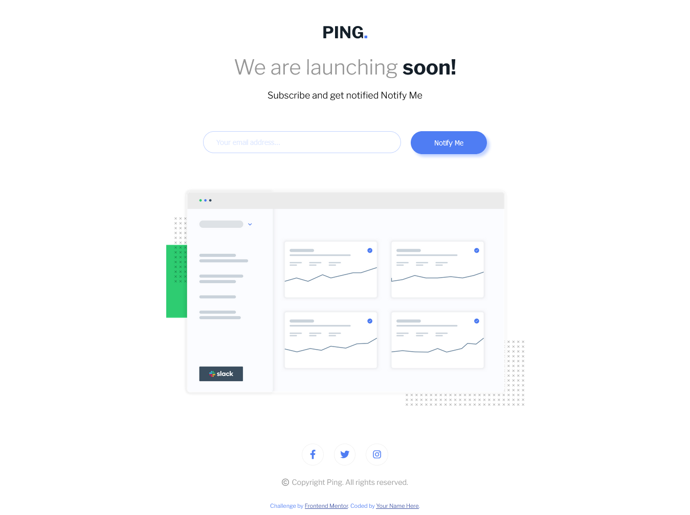
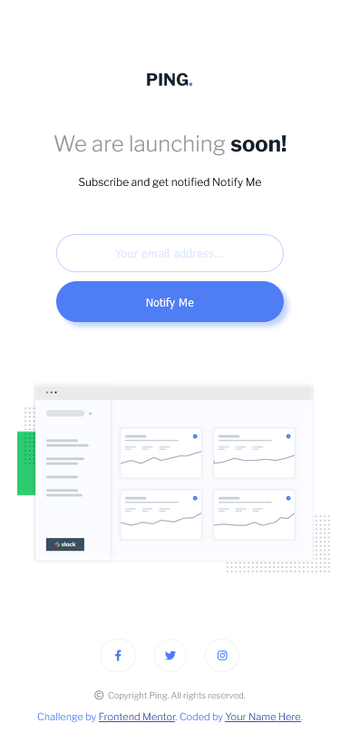

# Frontend Mentor - Ping coming soon page solution

This is a solution to the [Ping coming soon page challenge on Frontend Mentor](https://www.frontendmentor.io/challenges/ping-single-column-coming-soon-page-5cadd051fec04111f7b848da). Frontend Mentor challenges help you improve your coding skills by building realistic projects.

## Table of contents

- [Overview](#overview)
  - [The challenge](#the-challenge)
  - [Screenshot](#screenshot)
  - [Links](#links)
- [My process](#my-process)
  - [Built with](#built-with)
  - [What I learned](#what-i-learned)
  - [Continued development](#continued-development)
  - [Useful resources](#useful-resources)
- [Author](#author)
- [Acknowledgments](#acknowledgments)

**Note: Delete this note and update the table of contents based on what sections you keep.**

## Overview

### The challenge

Users should be able to:

- View the optimal layout for the site depending on their device's screen size
- See hover states for all interactive elements on the page
- Submit their email address using an `input` field
- Receive an error message when the `form` is submitted if:
  - The `input` field is empty. The message for this error should say _"Whoops! It looks like you forgot to add your email"_
  - The email address is not formatted correctly (i.e. a correct email address should have this structure: `name@host.tld`). The message for this error should say _"Please provide a valid email address"_

### Screenshot

### Links

- Solution URL: [Github Repo](https://github.com/MohammedHelal/ping-coming-soon-page)
- Live Site URL: [Live Site](https://mohammedhelal.github.io/ping-coming-soon-page/)

## My process

### Built with

- Semantic HTML5 markup
- CSS custom properties
- Flexbox
- [React](https://reactjs.org/) - JS library
- [Vite js](https://vitejs.dev/) - React Build Tool

### What I learned

I explored error validation in this challenge and styling a full page was suprisingly more challenging

### Continued development

I still feel my CSS styling needs more work, I will conitnue improving on this.

### Useful resources

- [Email Validation Regex](https://www.w3resource.com/javascript/form/email-validation.php) - This helped me with the email validation regex.

## Author

- CodeSandBox - [MohammedHelal](https://codesandbox.io/u/MohammedHelal)
- Frontend Mentor - [@MohammedHelal](https://www.frontendmentor.io/profile/MohammedHelal)
